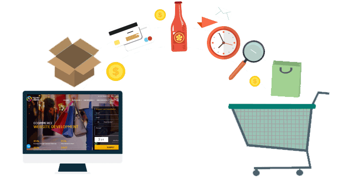
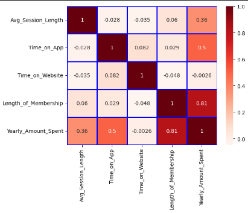
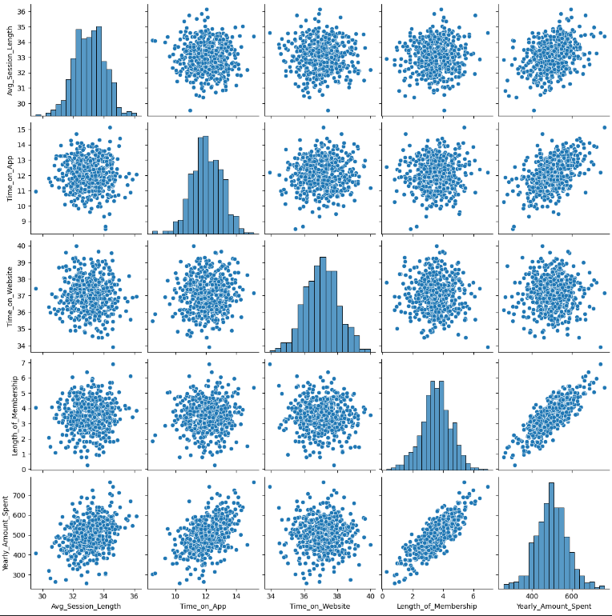

# E-Commerce-Customers-Data-Analysis

---

## Table of Contents

- [Introduction](#introduction)
- [Data Sources](#data-sources)
- [Problem statement](#problem-statement)
- [Skills/ Concepts demonstrated](#skills-concepts-demonstrated)
- [Visualization](#visualization)
- [Recommendations](#recommendations)
- [References](#references)

## Introduction
This project tackles an important question for an E-Commerce clothing company in Iowa. They offer both online and in-store style consultations, but they need to decide where to focus their resources. Should they put more effort into their mobile app or their website? The goal is to make sure customers are happy and buy more clothes, so the company wants to know which platform is better for customer engagement and sales.

## Data Sources
The dataset is downloaded from the [Kaggle](https://www.kaggle.com/datasets/srolka/ecommerce-customers).Also the dataset is attached in the Repository 👉 [click here](https://github.com/Thadkapally-Saikiran/Ecommerce-Customers/blob/main/Ecommerce%20Customers.csv)

Working with the Ecommerce Customers csv file from the company. It has total 8 columns - Customer info such as Email, Address, and their color Avatar. Then it also has numerical value columns:
 * Avg. Session Length: Average session of in-store style advice sessions.
 * Time on App: Average time spent on App in minutes.
 * Time on Website: Average time spent on Website in minutes.
 * Length of Membership: How many years the customer has been a member ?
 * Yearly Amount Spent: How much amount the customer have spent ?

## Problem statement
1. Analyze customer behavior and spending patterns:
   * The goal is to understand how various customer engagement metrics (time on app, website, session length, membership duration) influence their yearly spending on an e-commerce platform
3. Identify key drivers of customer spending:
   * By visualizing the correlations between engagement metrics and spending, you aim to pinpoint which factors have the strongest positive impact on customer spending
4. Optimize customer engagement strategies:
   * The insights from the data analysis can be used to develop strategies that encourage customer retention (lengthening memberships) and increase app engagement to drive higher spending.
 
## Skills/ Concepts demonstrated

The following Python vs Machine Learning features were incorporated:
- Importing the required libraries i.e. Pandas, Numpy, Matplotlib, Seaborn, Scikit-Learn
- Reading the dataset using "Pandas"
- Exploratory Data Analysis(EDA): Understanding and Cleaning the Data
- Statistical Correlation Analysis
- Visualizing Data using Seaborn library
- Draw Insights from visual Data and conclude data driven decision upon problem-statement
- Machine Learning Model Building
   * Separating the dataset into features and target data
   * Split the data set into train and test
   * Implementing the Linear Regression Model
   * Evaluating the prediction scores.
   * Visualizing the results
   * Repeat this for remaining Models(Decision Trees, RandomForest, K-NearestNeighbour, XGBoost, Adaboost)
- Evaluating the model accuracy.
- Compare the Models Evaluation Scores, Metrics and select the best Model performence

## Visualization:

Heat-Map   
---
  

Pair-Plot
---

## Recommendations

Based on the analysis, we recommend the following actions:
- Focus on improving app engagement
   * Since there seems to be a strong correlation between time spent on the app and amount of money spent, you can focus on strategies to keep users engaged with the app for longer periods of time. This could include things like gamification, personalized recommendations, and exclusive offers for app users.
- Target website visitors with retargeting campaigns
  * Since time spent on the website also seems to be correlated with spending, you can target website visitors with retargeting campaigns to encourage them to make a purchase.
- Develop strategies to retain members
  * The data suggests that longer memberships lead to higher spending. You can develop strategies to retain members, such as offering loyalty programs and exclusive benefits for long-term members.
- Develop strategies to retain existing members
  *  This could include offering loyalty programs, discounts, or exclusive content to members.
- Encourage customers to sign up for memberships
  * You could offer a free trial or discount on the first year of membership.
- Target your marketing campaigns to high-value customers
  * These are the customers who are most likely to spend a lot of money on your platform.

## References
1. Popular Machine Learning Algorithms.
   - [Kaggle](https://www.kaggle.com/code/marcovasquez/top-machine-learning-algorithms-beginner)
2. Python Docs for your reference
   - [Python Docs](https://docs.python.org/3/tutorial/)
3. [Pandas](https://pandas.pydata.org/docs/)
4. [Matplotlib](https://matplotlib.org/stable/users/getting_started/)
5. [Seaborn](https://seaborn.pydata.org/tutorial/introduction.html)
6. [scikit-learn](https://scikit-learn.org/stable/getting_started.html)

😄

💻

